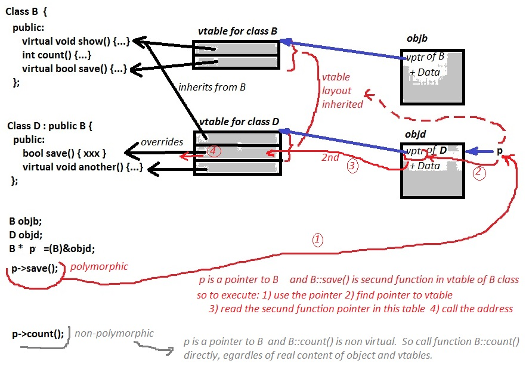

# Classes

## Declaration

## Non-static data members

## Bit fields

## Member functions

## `this`

## Static members

## Nested classes

- Nested class has access to all private members of the enclosing class, but enclosing class cannot access nested class's private members unless declared as a `friend`

## Derived Class 

- If the access specifier is omitted, it defaults to `public` for structs and `private` for classes 

```cpp
struct Base {
    int a, b, c;
};

// every object of type Derived includes Base as a subobject
struct Derived : Base {
    int b;
};

// every object of type Derived2 includes Derived and Base as subobjects
struct Derived2 : Derived {
    int c;
};
```

- Classes in the base clause are **direct base classes** and their bases are **indirect base classes**
- The same class cannot be specified as a direct base class more than once, but the same class can be both direct and indirect base class (through multiple inheritance)
- Each **direct** and **indirect** base class is present, as base class **subobject**, within the object representation of the derived class at an **ABI-dependent offset**
- **Empty base classes** usually **do not increase the size of the derived object** due to **empty base optimization**
- `public` inheritance 
    - **all public members** of the base class are accessible as **public members** of the derived class
    - **all protected members** of the base class are accessible as **protected members** of the derived class
    - **private** members of the base are **never accessible** unless **friended**
    - Public inheritance models the **IS-A** relationship (derived class should be usable where a base class is expected)
- `protected` inheritance
    - **all public and protected members** of the base class are accessible as **protected members** of the derived class 
    - **private members** of the base are **never accessible** unless **friended**
- `private` inheritance
    - **all public and protected members** of the base class are accessible as **private members** of the derived class 
    - **private members** of the base are **never accessible** unless **friended**


## Empty Base Optimization (EBO)
- The **size** of any **object** or **member subobject** is required to be **at least 1**, even if the type is an **empty class type** (i.e. a class or struct that has no non-static data members) (unless with `[[no_unique_address]]` (since C++20)), in order to be able to guarantee that the **addresses of distinct objects** of the same type are **always distinct**.
- However, **base class subobjects** are not so constrained, and can be **completely optimized** out from the object layout

```cpp
struct Base {}; // empty class, size = 1

struct Derived1 : Base { // size = sizeof(int)
    int i;
};

struct Derived2 : Base {}; // size = 1
    // empty base optimization applies

struct Derived3 : Base {
    Derived1 c; 
    int i;
}; // size = 3 * sizeof(int)
```

- EBO does **not** apply when there would be **two subobjects** of the **same type** sharing the **same address**
- If a derived class inherits from an empty base, and its **first non-static data member** is of that **exact same empty base type**, EBO is disabled. 
    - If EBO were applied, the base class subobject and the first member subobject would have the same address, violating object identity rules.

```cpp
class Empty {};

class FailsEBO : public Empty {
    Empty mem; // First member is of the same type as the base
    int x;
};
// sizeof(FailsEBO) == 8 
// (Base subobject gets 1 byte, mem gets 1 byte, padded to match int alignment)
```

- If you inherit from **multiple empty classes**, they can all undergo EBO, **unless they are the same type**. 
    - You cannot inherit from the same base class twice directly, but you can via a chain. 
    - If **two identical empty base subobjects** exist in the same layout, they must have **different addresses**, disabling EBO for at least one.

```cpp
class Empty {};
class Base1 : public Empty {};
class Base2 : public Empty {};

class Derived : public Base1, public Base2 {};
// sizeof(Derived) == 2 (or more due to alignment)
// Base1::Empty and Base2::Empty cannot share an address.
```

- If the empty base class has a **virtual function**, it is no longer structurally "empty". The compiler must inject a virtual method table pointer (vptr) into the class layout.
```cpp
class SemiEmpty {
    virtual void foo() {}
};
// sizeof(SemiEmpty) == 8 (on a 64-bit architecture due to the vptr)
```
- For C++20 and later, if you want EBO-like behavior for **data members** rather than base classes, you can use the `[[no_unique_address]]` attribute. 
    - This signals to the compiler that an empty member can share an address with other fields.

```cpp
class Derived {
    [[no_unique_address]] Empty e; // Takes 0 bytes if Empty is truly empty!
    int x; 
};
```

## Virtual Functions

- Virtual functions are functions that can be overridden by subclasses, and whose behaviour depends on the runtime type of the object, not the base type / reference / pointer to the object
- Virtual call is suppressed by using *qualified name lookup* (using scope resolution operator `::`)
- The overriding function must have the same **name**, **parameter type list**, **cv-qualifiers** and **ref-qualifiers**
    - Does not have to have the same return type as the original function
- Default arguments for virtual functions are substituted at **compile time**
- The return type of the overriding function must be **the same** or **covariant**
- Two types are covariant if:
    - both types are **pointers** or **references** (lvalue or rvalue) to classes
    - the return type in the base function must be a direct or indirect base class of the return type in the derived function
    - the return type of the derived function must be **equally or less cv-qualified** than the base function

```cpp
struct Base {
    virtual void foo() { cout << "base\n"; }
};

struct Derived : Base {
    void foo() override { cout << "derived\n"; } 
    // 'override' is optional
};

int main() {
    Base b;
    Derived d;

    // virtual function call through reference
    Base& br = b; // the type of br is Base&
    Base& dr = d; // the type of dr is Base& as well
    br.f(); // prints "base"
    dr.f(); // prints "derived"

    // virtual function call through pointer
    Base* bp = &b; // the type of bp is Base*
    Base* dp = &d; // the type of dp is Base* as well
    bp->f(); // prints "base"
    dp->f(); // prints "derived"

    // non-virtual function call
    br.Base::f(); // prints "base"
    dr.Base::f(); // prints "base"
}
```

- The function in the base class **does not have to be accessible or visible** to be overridden

```cpp
class B {
    virtual void do_f(); // private member
public:
    void f() { do_f(); } // public interface
};

struct D : public B {
    void do_f() override; // overrides B::do_f
};

int main() {
    D d;
    B* bp = &d;
    bp->f(); // internally calls D::do_f();
}
```

- `override` ensures that a function actually overrides an inherited function. If a function declares `override` but does not actually override a function, the program is ill-formed

```cpp
struct B {
    virtual void f(int);
};

struct D : B {
    virtual void f(int) override;  // OK, D::f(int) overrides B::f(int)
    virtual void f(long) override; // Error: f(long) does not override B::f(int)
};
```

- `final` prevents a function from being overridden by a derived class

```cpp
struct B {
    virtual void f() const final;
};

struct D : B {
    void f() const; // Error: D::f attempts to override final B::f
};
```

- `final` can also be used in class/structs to prevent it from being derived from (cannot be inherited by another class)
    - It can be used with `union` but it has no effect, since unions cannot be derived from

```cpp
struct Base {
    virtual void foo();
};

struct A : Base {
    void foo() final; // Base::foo is overridden and A::foo is the final override
    void bar() final; // Error: bar cannot be final as it is non-virtual
};

struct B final : A { // struct B is final
    void foo() override; // Error: foo cannot be overridden as it is final in A
};

struct C : B {}; // Error: B is final
```

### Virtual Base Class 

- **Virtual inheritance** (i.e. `class Derived : virtual Base`) prevents inheriting multiple copies of the same class member
    - This applies for both function members and data members
    - The compiler organizes memory such that there is only one Base class **subobject** in `Derived`'s memory block
    - Note that **both** `B` and `C` have to use virtual inheritance
        - Declaring `virtual` inheritance is essentially saying the class agrees to **share a single copy of the parent class** with other derived classes
    - When a Derived class inherits from a Base class, the Derived class is said to contain a **subobject** of the Base class
    - Instead of directly including the base class's members in the Derived class's layout, it includes a reference/pointer to the base class subobject
    - This ensures there is only one shared base class subobject among multiple paths of inheritance

```cpp
// The problem
class A { void f(); }
class B : public A {};
class C : public A {};
class D : public C, D {}

D d;
d.f(); // Error: multiple candidates

// The solution
class A { void f(); }
class B : virtual public A {};
class C : virtual public A {};
class D : public C, D {};

D d;
d.f(); // ok

// Another example of the diamond problem (still compiles)
struct A {};
struct B : public A {};
struct C : virtual public B {};
struct D : public A {};           // D bypasses B and goes straight to A!
struct E : public C, public D {}; // E has two copies of A

// The fix 
struct A {};
struct B : virtual public A {};
struct C : virtual public B {};
struct D : virtual public A {};
struct E : public C, public D {}; // Only one copy of A

```
- If either class does not declare `virtual A`, they will bring their own private copy of `A` into `D`, while the other one sets up a pointer to a shared `A`, so `D` will still end up with two copies of `A` (this is **allowed** and **still compiles**)
    - Compile errors only arise when there is **ambiguity** in resolving the data members between the different objects, in which case you have to explicitly use a qualified reference to specify **which** object's data member you are referencing
    - Having **multiple copies** of a base class is structurally allowed in C++

```cpp
// Another example (still compiles)
struct B { int n; };
class X : public virtual B {};
class Y : virtual public B {};
class Z : public B {};

// every object of type AA has one X, one Y, one Z, and two B's:
// one that is the base of Z and one that is shared by X and Y
struct AA : X, Y, Z
{
    AA()
    {
        X::n = 1; // modifies the virtual B subobject's member
        Y::n = 2; // modifies the same virtual B subobject's member
        Z::n = 3; // modifies the non-virtual B subobject's member
        
        std::cout << X::n << Y::n << Z::n << '\n'; // prints 223
    }
};
```

- Every virtual function has a **final overrider** which is the actual function that gets executed
    - A derived class is the final overrider if it does not declare or inherit (through multiple inheritance) another function that overrides the virtual function
    - Can think of final overrider as the 'last' class which provided an override for the function

```cpp
struct A { virtual void f(); };     // A::f is virtual
struct B : A { void f(); };         // B::f overrides A::f in B
struct C : virtual B { void f(); }; // C::f overrides A::f in C

// D does not introduce an overrider, B::f is final in D
struct D : virtual B {}; 

// E does not introduce an overrider, C::f is final in E 
struct E : C, D {        
    using A::f; // not a function declaration, just makes A::f visible to lookup
};

int main() {
    E e;
    e.f();    // virtual call calls C::f, the final overrider in e
    e.E::f(); // non-virtual call calls A::f, which is visible in E
}

/*
Explanation:
- D does not override f(), so its final overrider is its parent's version: B::f().
- C does explicitly override f(), creating C::f(). 
- Because C inherits from B, C::f() is considered more derived (more dominant) than B::f().

When E inherits from both C and D:
- The compiler looks down the D path and sees B::f().
- The compiler looks down the C path and sees C::f().
- The compiler notices that C::f() is an overrider of B::f() further down the line.

Because C::f() dominates B::f(), C::f() completely hides B::f().

There is no tie or conflict to break, so C::f() wins automatically,
regardless of the inheritance order.
*/
```

- If a function has **more than one final overrider**, the program is *ill-formed*
    - The multiple final overriders must be **at the same level of dominance** (i.e., they don't know about each other)

```cpp
struct A { virtual void f(); };

struct VB1 : virtual A { void f(); }; // overrides A::f 

struct VB2 : virtual A { void f(); }; // overrides A::f

// struct Error : VB1, VB2 {
//     // Error: A::f has two final overriders in Error
// };

struct Okay : VB1, VB2 {
    void f(); // OK: this is the final overrider for A::f
};

struct VB1a : virtual A {}; // does not declare an overrider

struct Da : VB1a, VB2 {
    // in Da, the final overrider of A::f is VB2::f
};
```

- If a function has the **same name** but **different parameter list**, it does not override the base function but instead **hides** it
    - Additionally, if the base class does not specify `virtual` on a function, even if a child class declares the same function, it **does not override** the base class's function but rather **hides** it (two separate functions are created)
    - **Name hiding is aggressive**, so **all** of the base class's functions with the function name are **hidden by name alone**, even if it defines multiple functions of that name with different parameter lists

```cpp
struct B {
    virtual void f();
};

struct D : B {
    void f(int); // D::f hides B::f (wrong parameter list)
};

struct D2 : D {
    void f(); // D2::f overrides B::f (doesn't matter that it's not visible)
};

int main() {
    B b;
    B& b_as_b = b;
    
    D d;
    B& d_as_b = d;
    D& d_as_d = d;
    
    D2 d2;
    B& d2_as_b = d2;
    D& d2_as_d = d2;
    
    b_as_b.f();  // calls B::f()
    d_as_b.f();  // calls B::f()
    d2_as_b.f(); // calls D2::f()
    
    d_as_d.f();  // Error: lookup in D finds only f(int)
    d2_as_d.f(); // Error: lookup in D finds only f(int)
}
``` 

### Initialization

- The **most derived class** is responsible for **initializing a virtual base class** (call the constructor of the virtual base class)
    - If the virtual base class provides a default no-args constructor, the call can be omitted
    - Otherwise, the most derived class must call the constructor of the virtual base class in it's own constructor's initializer list
    - The most derived class is just the type of the object being created (not whether it is the end of a subclass chain)
    - A class can have subclasses but when creating an instance of it, it is considered the most derived
    - Intermediate classes (those that sit between the class and the virtual base class) call to construct the virtual base class is skipped/ignored
    - This is so that there only exists one instance of the virtual base class object
- **Initialization Order**
    1. <u>Virtual base classes first</u>: All virtual base classes in the inheritance tree are constructed first. They are constructed **in the order they are declared** in the class inheritance list, in a **depth-first, left-to-right traversal** of the inheritance graph
    2. <u>Non-virtual direct base classes second</u>: Only after all virtual bases are completely built does the compiler move to non-virtual bases. These are constructed in the **exact order** they are declared in the class inheritance list (left-to-right).
    3. <u>Members and Derived Class Last</u>: Non-static member variables are initialized (in the order they are declared in the class body), and finally, the derived class's own constructor body runs.


```cpp
class TopLeft {};
class Left : public TopLeft {};

class TopRight {};
class Right : public TopRight {};

// Multiple inheritance combining both branches
class Derived : public Left, public Right {};

// Order: TopLeft -> Left -> TopRight -> Right -> Derived
```

:::warning[ ‎ ]
The order you write initializers in the **constructor's initialization list** (e.g., `D() : C(), B() {}`) is **completely ignored** by the compiler. The compiler always relies strictly on the **class declaration order** (`class D: B, C`) to prevent dependency bugs.
:::

### Virtual Destructors

- Even though destructors are **not inherited**, if a base class declares its destructor `virtual`, the derived destructor **always overrides it**
- This makes it possible to delete **dynamically allocated objects** of polymorphic type through **pointers to base**
- If the destructor of the base class is not virtual, deleting a **derived class object** through a **pointer to the base class** is **undefined behavior**, regardless of whether there are resources that would be leaked if the derived destructor is not invoked, unless the selected deallocation function is a destroying `operator delete` (since C++20).

```cpp
class Base {
public:
    virtual ~Base() { /* releases Base's resources */ }
};

class Derived : public Base {
    ~Derived() { /* releases Derived's resources */ }
};

int main() {
    Base* b = new Derived;
    delete b; // Makes a virtual function call to Base::~Base()
              // since it is virtual, it calls Derived::~Derived() which can
              // release resources of the derived class, and then calls
              // Base::~Base() following the usual order of destruction
}
```

### Virtual Table / Pointer

- A **virtual table** (vtable) is a mechanism used by the compiler to support **runtime polymorphism** and **dynamic dispatch**
    - There is exactly **one** vtable **per class**, stored in the **read-only data segment** of the program's memory. It is shared across objects of that class.
    - A vtable is a static array of **function pointers** generated by the compiler for every class that declares or inherits at least one `virtual` function
    - A **virtual pointer** (vptr) is a **hidden pointer** added by the compiler to every **object** instance of a polymorphic class. It is usually placed at the **very beginning** of the object's memory layout, **pointing to the class's vtable**

```cpp
class Base {
public:
    virtual void func1() { std::cout << "Base::func1\n"; }
    virtual void func2() { std::cout << "Base::func2\n"; }
    void nonVirtual()    { std::cout << "Base::nonVirtual\n"; } // No entry in vtable
};

class Derived : public Base {
public:
    void func1() override { std::cout << "Derived::func1\n"; } // Overrides func1
    // func2 is inherited from Base
};

/*
Base vtable holds pointers to Base::func1() and Base::func2()

Derived vtable holds pointers to Derived::func1() 
(because it was overridden) and Base::func2() (inherited)
*/

int main() {
    Base* ptr = new Derived();
    
    // 1. Static Resolution (Compile-time binding)
    ptr->nonVirtual(); // Outputs "Base::nonVirtual"
    
    // 2. Dynamic Resolution (Runtime binding via vtable)
    ptr->func1();      // Outputs "Derived::func1"
}
```
- When `ptr->func1()` is parsed, the compiler translates the call into something similar to `(*(ptr->_vptr[0]))(ptr);`
- vtables carry minor **performance and memory overheads**
    - Each object has one more pointer (8 bytes, or 4 depending on the architecture) due to vptr
    - Calling a virtual function requires extra **pointer indirection** (object -> vptr -> vtable -> code address), compared to direct jumps used by non-virtual functions
    - Virtual functions can **prevent the compiler from optimizing** via **inlining**, as the exact target function cannot be completely verified until runtime



## Abstract Base Class (ABC)

- Defines an abstract type which **cannot be instantiated**, but **can be used as a base class**.
    - Used to represent general concepts (for example, Shape, Animal), which can be used as base classes for concrete classes (for example, Circle, Dog).
    - **No objects of an abstract class can be created** (except for base subobjects of a class derived from it) and **no non-static data members whose type is an abstract class** can be declared.
    - Abstract types **cannot be used as parameter types**, as **function return types**, or as the **type of an explicit conversion** (note this is checked at the point of definition and function call, since at the point of function declaration parameter and return type may be incomplete).
    - **Pointers** and **references** to an abstract class can be declared.
:::info[‎]
A pure virtual function **forces subclasses to override it** (otherwise, the subclass also becomes an abstract base class). 

A base class becomes an **abstract base class** when it **declares a pure virtual function**.
:::
- A **pure virtual function** is a virtual function whose declarator has the following syntax:
```cpp
declarator virt-specifier (optional) = 0
```
- The sequence `= 0` is known as **pure-specifier**, and appears either immediately after the declarator or after the optional virt-specifier (`override` or `final`).
- pure-specifier **cannot** appear in a **member function definition** (i.e. with a method body) or **friend declaration**.

```cpp
struct Abstract {
    virtual void f() = 0;  // pure virtual
}; // "Abstract" is abstract

struct Concrete : Abstract {
    void f() override {}   // non-pure virtual
    virtual void g();      // non-pure virtual
}; // "Concrete" is non-abstract

struct Abstract2 : Concrete {
    void g() override = 0; // pure virtual overrider
}; // "Abstract2" is abstract

int main() {
    // Abstract a;   // Error: abstract class
    Concrete b;      // OK
    Abstract& a = b; // OK to reference abstract base
    a.f();           // virtual dispatch to Concrete::f()
    // Abstract2 a2; // Error: abstract class (final overrider of g() is pure)
}
```
- The **definition** of a pure virtual function **may be provided** (and **must be provided** if the pure virtual is the **destructor**)
    - The member functions of the derived class are free to call the abstract base's pure virtual function using qualified function id
    - This definition must be provided **outside of the class body** (the syntax of a function declaration doesn't allow both the pure specifier = 0 and a function body).
    - Making a **virtual call** to a **pure virtual function** from a **constructor** or the **destructor** of the **abstract class** is **undefined behavior** (regardless of whether it has a definition or not).
- Providing a definition for a pure virtual function gives derived classes an implementation to fall back on

```cpp
struct Abstract {
    virtual void f() = 0; // pure virtual
    virtual void g() {}   // non-pure virtual
    
    ~Abstract() {
        g();           // OK: calls Abstract::g()
        // f();        // undefined behavior
        Abstract::f(); // OK: non-virtual call
    }
};

// definition of the pure virtual function
void Abstract::f() {
    std::cout << "A::f()\n";
}

struct Concrete : Abstract {
    void f() override {
        Abstract::f(); // OK: calls pure virtual function
    }
    
    void g() override {}
    
    ~Concrete() {
        g(); // OK: calls Concrete::g()
        f(); // OK: calls Concrete::f()
    }
};
```

- If the destructor is the pure virtual function,
    - When an **object** of a **derived class** is **destroyed**, the compiler **executes the destructors in reverse order**, winding all the way back up to the base class
    - If `~Base()` doesn't have a body, the program will fail to link because the derived class destructor tries to call a function body that doesn't exist.
    - The most common use case of the destructor being pure virtual is when you want to create an abstract base class, but it doesn't have any natural functions that make sense to be pure virtual
    - The standard convention is to make the destructor pure virtual

```cpp
class Interface {
public:
    virtual ~Interface() = 0; // Pure virtual destructor
};
Interface::~Interface() {
    // Clean up base resources if any exist
}
```

## Member Access

## `friend`

- Allows an external class / function to access private members of the class

```cpp
class A{
private:
    int x;
public:
    friend ostream& operator<<(ostream& os, const A& a);
}
ostream& operator<<(ostream& os, const A& a) { 
    os << a.x << endl;
}
```

## Constructors \& Destructors

### Default constructor
- A constructor which can be called with no arguments
- If there is no user-declared constructor, the compiler generates a default constructor (so long as the class is trivial)

### Deleted default constructor
- The compiler will **refuse** to automatically generate a default constructor for a class if it cannot figure out a safe, legal way to initialize every part of the class without external input
    - Uninitialized references: `int& ref;`
    - Uninitialized `const` data members: `const int x;`
        - Exception: if the `const` member is a class type that has its own valid default constructor, this rule does not apply, because it knows how to initialize itself
    ```cpp
    struct Example {
        const int max_value; // Error: What is the value? 
                            // Deletes the default constructor.
    };
    ```
    - The subobject cannot be created: `M` does not have a default constructor, or its default constructor is `private`
    - The subobject cannot be destroyed: `M` has a private or `deleted` destructor (can't create an object that cannot be destroyed)

    ```cpp
    class Hidden {
    private:
        Hidden() {} // Private constructor!
    };

    struct Container {
        Hidden item; // Error: Container cannot build 'item' because it's private.
                    // Container's default constructor is deleted.
    };
    ```

    - Explicitly deleting the default constructor with `= delete`

    ```cpp
    struct Target {
        int id;
        
        // Explicitly deleting the default constructor
        Target() = delete; 
        
        Target(int custom_id) : id(custom_id) {}
    };

    // Target t1;      // Compiler Error!
    Target t2{101};
    ```

    - Unions where everything is `const`

    ```cpp
    union Example {
        const int x;
        const double y; // All members are const. Default constructor deleted.
    };
    ```

### Trivial default constructor

- A class `T` must meet all of the following conditions:
    - Must not be user-defined (must be implicitly generated by compiler or explicitly forced using `=default`)
    - No virtual functions
    - No virtual base classes
    - Trivial base classes
    - Trivial non-static members
    - No default member initializers 
- The concept of triviality is a core pillar of high-performance C++
    - If an object has a trivial default constructor, it means its memory footprint is just raw data. The compiler and runtime can bypass the usual object-oriented rules and treat the object like a block of bytes.
    - If you create an array of 1,000,000 trivial objects, the compiler executes an instant, single memory allocation. If the constructor were non-trivial, the program would have to loop through all 1,000,000 items and call the constructor function on each one individually.
    - Objects with trivial constructors (and trivial copy/destructors) are safely copyable via memory copying utilities like `std::memcpy`

```cpp
struct Trivial {
    int x;
    double y;
    // The compiler implicitly generates a trivial default constructor
};
struct NonTrivial1 {
    int x;
    NonTrivial1() { x = 0; } // Non-trivial: User defined code exists
};
struct NonTrivial2 {
    int x = 5; // Non-trivial: Compiler must generate code to assign 5
};

#include <type_traits>
#include <iostream>

struct Point { int x, y; };

int main() {
    // You can check triviality at compile-time using standard library traits
    std::cout << std::boolalpha;
    std::cout << "Is Point trivially default constructible? " 
              << std::is_trivially_default_constructible<Point>::value << "\n"; 
              // Outputs: true
}
```

```cpp
struct A
{
    int x;
    A(int x = 1): x(x) {} // user-defined default constructor
};
 
struct B : A
{
    // B::B() is implicitly-defined, calls A::A()
};
 
struct C
{
    A a;
    // C::C() is implicitly-defined, calls A::A()
};
 
struct D : A
{
    D(int y) : A(y) {}
    // D::D() is not declared because another constructor exists
};
 
struct E : A
{
    E(int y) : A(y) {}
    E() = default; // explicitly defaulted, calls A::A()
};
 
struct F
{
    int& ref; // reference member
    const int c; // const member
    // F::F() is implicitly defined as deleted
};

// user declared copy constructor (either user-provided, deleted or defaulted)
// prevents the implicit generation of a default constructor

struct G
{
    G(const G&) {}
    // G::G() is implicitly defined as deleted
};

struct H
{
    H(const H&) = delete;
    // H::H() is implicitly defined as deleted
};

struct I
{
    I(const I&) = default;
    // I::I() is implicitly defined as deleted
};

int main()
{
    A a;
    B b;
    C c;
//  D d; // compile error
    E e;
//  F f; // compile error
//  G g; // compile error
//  H h; // compile error
//  I i; // compile error
}
```

### Move / Copy Constructor

- To generate move ctor / assignment, cannot have user-defined copy ctor / assignment, user-defined move ctor / assignment, or destructor

- If a data member does not have a move constructor, the move constructor would be defined as deleted

- If you define move ctor/assignment, copy ctor/assignment is implicitly deleted (unless you explicitly declare)

- If you define copy ctor/assignment, it is not generated

- Direct initialization `C c1; C c2 = c1;` uses copy ctor, not copy assignment  

- The generated copy constructor does a member-wise copy of all non-static data members

- The generated move constructor does a member-wise move of all non-static data members by casting them to rvalue references with `std::move`

#### Best Practice

If you declare any custom constructor and you still want move semantics, you should explicitly declare the move constructor and move assignment as `= default` or implement them:

### Rule of Three/Five/Zero

- **Rule of Three**: If you define a custom destructor/copy ctor/assignment, you probably should define all three
- **Rule of Five**: If you define a custom destructor/copy ctor/assignment, move ctor/assignment, you probably should define all five
- If you leave it to the compiler, default generated functions perform a shallow copy, which duplicates memory addresses rather than the actual data, which can lead to double-free problems, memory leak etc.
- **Rule of Zero**: the modern approach - don't define any custom ctor, let the compiler handle it 

## `explicit` specifier

- Used for single argument constructors
- Require user to explicitly construct the class using direct initialization instead of relying on type conversion
- By default, any constructor that can be called with a single argument acts as an implicit "converting constructor"

```cpp
class A {
    int x;
    // A(int x): x(x) {} // implicit converting constructor
    explicit A(int x): x(x) {}
};

void foo(A a) {}

// A a = 5; // implicit conversion
// foo(5);  // implicit conversion

// With explicit specifier
A a(5);
A a{5};
foo(A(5));
```

## `= default` specifier (C++11)

- Tells compiler to generate the function without having to provide a definition
- Defining a custom constructor (e.g., a parameterized constructor) blocks the compiler from implicitly creating a default constructor
    - Adding `MyClass() = default;` brings it back
- Empty user-defined body (`{}`) makes the constructor "user-provided", making the class non-trivial 
    - Using `= default` allows the compiler to treat the function as **trivial**, enabling better optimizations
- Can **only** be used for **special member functions** (constructor, destructors)
    - `MyClass() = default;`
    - `MyClass(const MyClass&) = default;`
    - `MyClass(MyClass&&) = default;`
    - `MyClass& operator=(const MyClass&) = default;`
    - `MyClass& operator=(MyClass&&) = default;`
    - `~MyClass() = default;`

## `= delete`

- Tell the compiler to **not** generate the member function automatically
- Applies for constructor/destructor, as well as regular member functions
- Explicitly deleted functions still **fully participate in overload resolution**
    - If it somehow turns out to be the best match, the compiler halts and throws a compile error
- If you want to remove a candidate from overload resolution entirely so the compiler falls back to a different, less ideal match, `= delete` will not work
    - Instead, you must use SFINAE (`std::enable_if_t`) or C++20 Concepts (`requires` clauses) to conditionally exclude the function during the candidate phase
