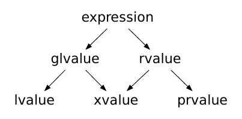

# Expressions

## Value Categories

Each expression in C++ is categorized by its _type_ and its _value category_.

There are five main value categories in C++: glvalue, lvalue, xvalue, rvalue, prvalue. 

- An lvalue can be thought of as anything that you can refer to by name that has a specific address in memory
- An xvalue can be thought of as an object which is expiring and whose resources can be used up  
- A glvalue ("generalized" lvalue) is an lvalue or an xvalue
- A prvalue ("pure" rvalue) can be thought of as a temporary object which does not have a fixed address in memory
- An rvalue is a prvalue or an xvalue

The following diagram summarizes this relationship:



rvalues can be bound to const lvalue references:

```cpp
String& a = String("test");         // Error, can't hold reference to a temporary value
const String& a = String("test");   // Ok
```

## Evaluation Order

The C++ standard does not specify the order in which expressions must be evaluated in (with a few exceptions). The evaluation order may differ from one run to another. This is not to be confused with operator associativity. 

The most basic example of unspecified order of evaluation is:

```cpp
f(a) + g(b) * h(c); 
```
The compiler can compute `f(a)`, `g(b)` and `h(c)` in any order it wants, but `g(b)` will always be multipled with `h(c)` before being added to `f(a)`. 

This applies to function arguments as well.

```cpp
f(x(a), y(b), z(c));
```
The compiler is free to order `x(a)`, `y(b)` and `z(c)` in any order it wants. 

The only guarantee is that each expression is evaluated to completion before another expression is evaluated. E.g. 
```cpp
foo(a(b()), c())
// if b() is evaluated, we are guaranteed a() is evaluated next
// (since c++17)
```


Evaluations are split into two types: *value computations* (the "return value" of the expression), and _side effects_ (read/writes to an object). Value computations include determining the identity of an object (glvalue evaluation) and reading the value assigned to an object (prvalue evaluation).

Two evaluations A and B can be related in three ways: _sequenced before_, _unsequenced_, or _indeterminately sequenced_. 
- If A is sequenced before B, then A will always complete fully before B (and vice versa) 
- If A and B are unsequenced, they may be performed in any order, and their CPU instructions may overlap (i.e. be interleaved)
- If A and B are indeterminately sequenced, they may be performed in any order, but their instructions will not overlap (no interleaving)

The cases in which the relationship is specified are:
- Each _full expression_ is sequenced before the next full expression
- The value computation (but not side effects) of operands to an operator is sequenced before the value computation (but not side effects) of the result of the operator 
    - (See below on how this impacted UB before C++17)
- Post-increment and post-decrement operator `x++`, `x--`
    - The value computation is sequenced before its side effect
- Pre-increment and pre-decrement operator `++x`, `--x` 
    - The side effect is sequenced before its value computation
- `&&`, `||`, `,` operator
    - The first operand (left) is sequenced before the second operand (right)
- Ternary operator `? :`
    - The first operand before `?` is sequenced before the second and third operator
- Assignment operator `=` and all compound assignment operators e.g. `+=`
    - The side effect (modification of the left operand) is sequenced **after** the value computation of both left and right operands, and  sequenced **before** the value computation of the assignment expression (returning the reference to the modified object)
    - Basically, evaluate left and right sides, then the assignment side effect becomes visible, then the reference to the object is returned
- List initialization (i.e. using curly braces, either direct-list `T t{...}` or copy-list `T t = {...}`)
    - In a comma-separated list of initializers e.g. `T t1{...}, t2{...}` or `T t1 = {...}, t2 = {...}` each initializer clause is sequenced before all other init clauses that follow after it
- Function calls
    - Function calls in the same expression are indeterminately sequenced with respect to one another
    - They can be evaluated in any order, but the program must behave as though their evaluations are not interleaved 
    - From C++17: function calls to standard library algorithms executing under `std::execution::par_unseq` are unsequenced and may be interleaved
- `operator new` 
    - Before C++17: the call to `new` is indeterminately sequenced with the constructor arguments
    - From C++17: the call to `new` is sequenced before the evaluation of the constructor arguments
- Function return values
    - The copy-initialization of the return value is sequenced before the destruction of temporaries used in the return value, which is sequenced before the destruction of local variables in scope
- From C++17:
    - In a function call expression (i.e. calling the function), the evaluation of the function name is sequenced before every argument expression and default argument 
    - In a function call (i.e. actually running the function), the initialization of function _parameters_ is indeterminately sequenced w.r.t each other
    - Overloaded operators obey the sequencing rules of the built-in operator
    - In subscript expression `E1[E2]`, `E1` is sequenced before `E2`
    - In pointer-to-member expression `E1.*E2` or `E1->*E2`, `E1` is sequenced before `E2` 
    - In shift operations `E1 << E2` and `E1 >> E2`, `E1` is sequenced before `E2` 
    - In every simple assignment `E1 = E2` and every compound assignment `E1 @= E2`, `E2` is sequenced before `E1`
    - (+ two more rules for direct initialization of aggregate and non-aggregate types)

The following are cases of undefined behaviour due to **two side effects** on a memory location being unsequenced:

```cpp
i = ++i + 2;       // well-defined
i = i++ + 2;       // undefined behavior until C++17
f(i = -2, i = -2); // undefined behavior until C++17
f(++i, ++i);       // undefined behavior until C++17, unspecified after C++17
i = ++i + i++;     // undefined behavior

void g(int x, int y);
g(i++, i++);       // C++17 makes this well-defined, but which x and y do you get?
```

The problem is that the standard did not specify when the side effect of incrementing/decrementing would take place relative to assigning the value to the left hand side operand.

The following are cases of undefined behaviour due to **side effect** on a memory location being unsequenced relative to a **value computation** using that same memory location:

```cpp
cout << i << i++; // undefined behavior until C++17
a[i] = i++;       // undefined behavior until C++17
n = ++i + i;      // undefined behavior
```

Before C++11, the concept of _sequence point_ was used.
A sequence point is a specific point in execution where all previous side effects (like updating a variable's value) were guaranteed to be complete. The concept of sequence points was replaced by sequencing  (sequenced before, unsequenced, indeterminately sequenced) in C++11.

## Operators \& Precedence

### Operator Overload


## Conversions

### Implicit Conversion

Implicit conversion occurs when passing a type `T1` into a context that does not accept that type but accepts another type `T2`. 
- This can be passing arguments to a function call, returning values of a different type than the declared return type, copy initialization, throw expressions, condition statements etc. Essentially, anywhere one type is expected and another is provided.
- The program is well-formed (compiles) only if there exists one unambiguous _implicit conversion sequence_ from `T1` to `T2`.

The general form of an implicit conversion sequence is: 
- zero or one _standard conversion sequence_
- zero or one _user-defined conversion sequence_
- zero or one _standard conversion sequence_, only if a user-defined conversion sequence was used


A _standard conversion sequence_ is composed of the following stages:
- zero or one conversions of:
    - lvalue-to-rvalue conversion 
    - array to pointer conversion 
    - function to pointer conversion 
    - Since C++17, there is also prvalue-to-xvalue conversion (i.e. _temporary materialization_):
        ```cpp
        struct S { int m; };
        const S& r = S{}; 
        int i = S().m; // prvalue converted to xvalue
        ```
- zero or one _numeric  promotion_ or _numeric conversion_ 
- zero or one _function pointer conversion_ (since C++17)
- zero or one _qualification conversion_
    - These can only _add_ cv qualifiers e.g. `int* -> const int* -> volatile const int*`, can't remove

A _user-defined conversion_ consists of zero or one _non-explicit,  single argument converting constructor_ or _non-explicit conversion function_.
- Converting constructors are constructors with only one argument (though it can have default arguments)
- Conversion functions follow the syntax `operator <type-id>() {...}`. They do not have return values and are usually marked `const` to prevent mutating state.

A converting constructor and conversion function look like this:
```cpp
class A {
    // converting constructor
    A(int x) {...}
    A(int x, int y = 1, int z = 2) { ... } // default arguments ok
    // as long as the ctor can be called with one argument
    
    // conversion function
    operator int() const { ... }; // usually marked const - shouldn't mutate state
}
A a = 5;   // ok, converting ctor called
int x = a; // ok, conversion function called
```

An expression `e` is said to be _implicitly convertible_ to `T2` iff `T2` can be _copy-initialized_ from `e`, i.e. `T2 t = e;` is well-formed. This is different from _direct initialization_ `T2 t(e);` where explicit constructors and conversion functions would additionally be considered.

Examples:
```cpp
struct A {
    operator int();
    A(double);
};
A a;
double d = a;
// A -> int (conversion function) -> double (promotion)

int x = 3;
A a = x;
// int -> double (promotion) -> A (converting ctor)
```

The implicit conversion sequence of one type to another is used to rank candidate functions during _function overload resolution_. Conversion sequences are roughly ranked as: exact match > promotion > conversion > user-defined > ellipsis. If the compiler cannot decide on which overload is ranked the highest, it throws a compile error.

```cpp
void f(int);
void f(long);
char c;
f(c); // f(int) is chosen (promotion) as compared to f(long) (conversion)


void g(double);
void g(long);
int x;
g(x); // Ambiguous, both use conversion
```
(Note: There is a thing called as _floating point conversion rank_ and _integral conversion rank_, but they don't apply here; conversion ranks only apply within their own family, there is no cross-family hierarchy)

### Numeric Promotion / Conversion

_Numeric promotion_ preserves values since the type is being "promoted" to a larger datatype that can hold a larger range of values. For example, `int -> long`, `char -> int`, `short -> int`, `float -> double`

On the other hand, _numeric conversion_ may lose information e.g. `int -> short`, `long -> int`, `double -> float` (precision loss), and even `float -> int`, `pretty much any type -> bool` (hence why overload resolution ranks numeric promotion over numeric conversion)

Side note: enums can be promoted to integral values as well.

### User-defined Conversion

User-defined conversion enables _implicit conversion_ or _explicit conversion_ from a class type to another type. They are the converting constructors and conversion functions in class/structs. 

If they are not marked `explicit`, they can participate in _both_ implicit and explicit conversion. However, if they are marked `explicit`, they can only participate in explicit conversions:
- `operator conversion-type-id`
    - Participates in all implicit and explicit conversions
- `explicit operator conversion-type-id`
    - Participates in direct initialization `T2 t(e);` and explicit conversions only
- `explicit ( expression ) operator conversion-type-id`
    - (Conditionally explicit)

Note: `conversion-type-id` cannot represent an array or a function type. Pointers to arrays/function types are still valid, but only through a typedef (`[]` and `()` are not allowed in the declarator for `conversion-type-id`)

```cpp
struct X {
    operator int() const { return 7; } // implicit conversion
    
    explicit operator int*() const { return nullptr; } // explicit conversion

    // operator int(*)[3]() const { return nullptr; } 
    // Error: array operator not allowed in conversion-type-id
    
    using arr_t = int[3];
    operator arr_t*() const { return nullptr; } // OK if done through typedef
//  operator arr_t () const; // Error: conversion to array not allowed in any case
};

int main() {
    X x;

    int n = static_cast<int>(x);   // OK: sets n to 7
    int m = x;                     // OK: sets m to 7

    int* p = static_cast<int*>(x); // OK: sets p to null
//  int* q = x; // Error: no implicit conversion

    int (*pa)[3] = x;  // OK
}
```

`explicit operator bool()` is a user-defined conversion function that allows an object to be safely evaluated as a boolean context (like an `if` statement) while preventing accidental or unsafe implicit conversions to arithmetic types.

Before C++11, developers used `operator bool()` without the `explicit` keyword. This caused a major safety issue, where the compiler would secretly convert the object into an integer in unexpected places. So the `explicit` keyword as part of the _safe bool idiom_.
```cpp
struct A {
    operator bool() const { return true; }
};

A obj;
int x = obj; // obj implicitly becomes 1
// A -> bool -> int

// Adding explicit solves this. It allows the object to convert to bool 
// only where a boolean is explicitly expected
// int x = obj; // no longer allowed
```

### Contextual Conversion 

These are cases where `bool` is expected, e.g. inside an `if` or `while` condition. 

In these cases, implicit conversion is performed if the declaration `bool t(e);` is well-formed (i.e. an `explicit operator bool() const` is considered). Such an expression `e` is said to be _contextually converted_ to `bool`.

The cases are:
- control expressions of `if`, `while`, and `for`
- the operands of built-in logical operators `!`, `&&`, `||`
- the first operand of the conditional operator `?:`
- the predicate in a `static_assert` declaration 
- the expression in a `noexcept` specifier 

### Explicit Casting

Explicit casting can be split into C-style casting (the old `(int) x` style) and functional style casting e.g. `int(x)`.

When the C-style cast is encountered, the compiler attempts to interpret it as the following cast expressions, in this order:
- `const_cast`
- `static_cast`
- `static_cast` followed by `const_cast`
- `reinterpret_cast`
- `reinterpret_cast` followed by `const_cast` 

- `std::static_cast<T>`
- `std::dynamic_cast<T>(expr)`
    - `expr` must be a pointer or reference to a _polymorphic class type_ (or `void*` in the special case of casting to `void*`) that has at least one _virtual function_, and the types being casted must be related by inheritance
    - Otherwise, if the cast is between unrelated types, the cast is ill-formed (compile error)
    - `dynamic_cast` can also cast _sideways_ between siblings of a parent base class 
- `std::const_cast<T>` 
- `std::reinterpret_cast<T>`

### Usual Arithmetic Conversions 
Many binary operators that expect operands of arithmetic or enumeration type cause conversions and yield result types in a similar way. The purpose is to yield a common type, which is also the type of the result. This pattern is called the _usual arithmetic conversions_.

Usual arithmetic conversion progresses in five stages. lvalue-to-rvalue conversion of both operands, checking of enum types, checking of _floating point conversion rank and subrank_, then checking of _integer conversion rank_

### Tricky questions

```cpp
void foo(float&&) { std::cout << "f"; }
void foo(int&&) { std::cout << "i"; }

template <typename... T>
void bar(T&&... v)
{
    (foo(v), ...);
}

int main()
{
    bar(1.0f, 2); // prints "if", not "fi"
}
```
- Although `1.0f` and `2` were passed in as prvalues, inside `bar` they become lvalues associated with the named variables `v1` and `v2` (after pack expansion)
    - `int&` cannot bind to `int&&` and likewise `float&` cannot bind to `float&&`
    - `float&` is converted into a prvalue `int`, so it calls `foo(int&&)` 
    - `int&` is converted into a prvalue `float`, so it calls `foo(float&&)`
    - If we used `foo(std::forward(v), ...)` instead, it would print `"fi"`

```cpp
struct C {
    C() { std::cout << "c"; }
    C(const C&) { std::cout << "C"; }

    void foo() { std::cout << "1"; }
};

struct D {
    D() { std::cout << "d"; }
    D(const C&) { std::cout << "D"; }

    void foo() { std::cout << "2"; }
};


auto bar(bool flag) {
    return flag ? C{} : D{};
}

int main() {
    bar(true).foo();
    bar(false).foo();
    // prints cD2d2
}
```
- `auto` tries to deduce the type of the return value in the two branches of `?`
- If they are different types, an attempt is made to form an implicit conversion sequence from one type to the other
- C can be converted to D via D's conversion constructor while D cannot be converted to C. Hence `auto` is inferred as D
- When `flag` is true, a temporary object of type C is first created. Then an object of type D is created via D's conversion constructor, `D(const C&)`

```cpp
struct X {
    operator void() {
        std::cout << "G";
    }
};

int main() {
    X x;
    (void)x;
    static_cast<void>(x);
    x.operator void();
} // prints "G"
```
- The object `x` is converted to void in three ways. 
    - The first is a C-style cast, the second is a `static_cast`, and finally we call the `void` operator manually. 
    - According to the C++ standard, conversion functions will **never** be used to convert an object to `void`. 
    - Hence, the conversion is only called once, when we manually invoke it via `operator void()`.
    - `static_cast<void>(x)` just discards the value, no actual result is produced and therefore no object of type `void` is created

## Strict Aliasing

- The strict alias rule states that objects can only be accessed through pointers of allowed types.
    - E.g. you can’t access an `int` through a `float*`
    - Compilers may optimize away such invalid memory accesses under the assumption that such accesses have no effect since the memory access is invalid. It may discard behaviour or generate unpredictable code (thus UB)
    - Common violations of strict aliasing are _type punning_ (i.e. treating same memory as a different type)
    - Common example: overlaying a struct onto a buffer or buffer onto struct 
    - Ways to avoid it:
        - `std::memcpy`: standard way to copy bits from one type to another. Optimizers may convert this into direct registers/instructions.
        - `std::bit_cast`: C++20 zero-cost type reinterpretation
    - Special cases 
        -  You can cast to `char*`, `unsigned char*`, `signed char*` and `std::byte*` to bypass the strict aliasing rule, since the C++ standard allows any object to be accessed with these types
        - Unions allow you to store different data in the same memory location (known as type punning). But the most recent write will overwrite any previous values.

## `alignof` / `alignas`

```cpp
struct MyUnAlignedStruct {
    char b;
};

struct alignas(8) MyAlignedStruct {
    char b;
};
int main() {
    cout << sizeof(MyUnAlignedStruct) << '\n'; // 1
    cout << sizeof(MyAlignedStruct) << '\n';   // 8
    
    MyAlignedStruct s, t;
    
    cout << "Address of s: " << &s << '\n';     // e.g. 0x7ffd57868100

    cout << "Alignment of MyAlignedStruct: " << alignof(MyAlignedStruct) << '\n'; // 8

    cout << "Address modulo 8 (should be 0): " 
         << (reinterpret_cast<uintptr_t>(&s) % 8) << '\n'; // 0

    cout << "Distance between t and s: " 
         << (reinterpret_cast<uintptr_t>(&t) - reinterpret_cast<uintptr_t>(&s)) <<'\n'; // 8
}
```


## Alternative Tokens

- C++ offers alternative tokens that can be used in place of certain punctuators
```cpp
int main() {
    int a[] = <%1,2%>; // {1,2}
    std::cout << a<:1:>;  // a[1]
}
```
- https://en.cppreference.com/cpp/language/operator_alternative 
- There are alternative spellings for several operators and other tokens that use non-ISO646 characters 
- Each alternative token behaves exactly the same as its primary token, except for its spelling (the [stringification operator](https://en.cppreference.com/cpp/preprocessor/replace "cpp/preprocessor/replace") can make the spelling visible). 
- The two-letter alternative tokens are sometimes called "digraphs". 
- Despite being four-letters long, `%:%:` is also considered a digraph.
