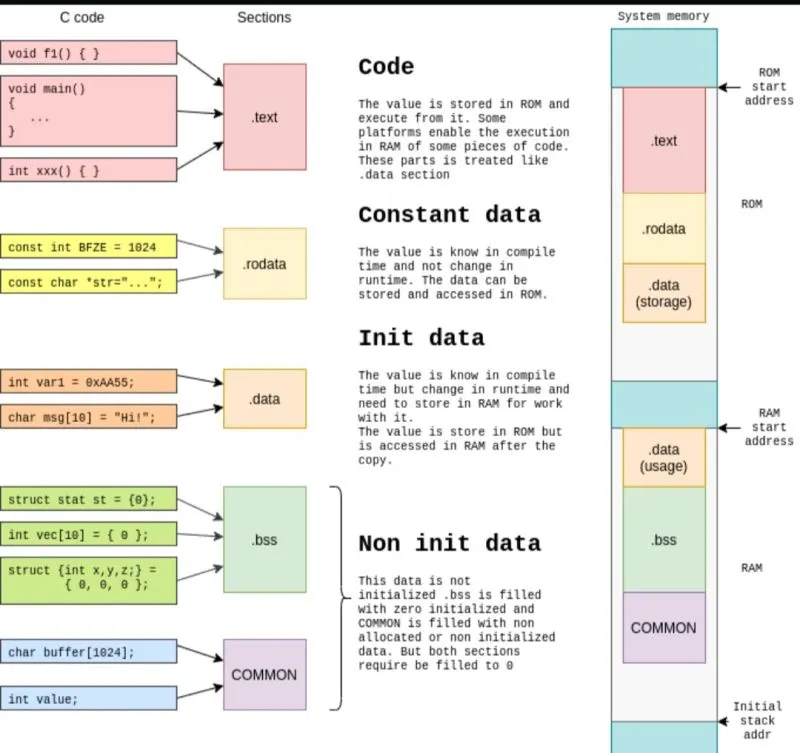

# Memory Layout

## Introduction 

Memory allocated to a C++ program is divided into several segments:
- Text (.text) segment: contains the _executable instructions_ of the program 
- Data (.data/.rodata) segment: hold global and static variables that are _initialized_ 
- .bss segment (block started by symbol): Contains global and static variables that are uninitialized, or initialized to zero
- Heap: dynamically allocated memory using functions like `malloc`
- Stack: used for local variables and function call management

The following diagram showcases a program's layout in memory.

The memory layout can be inspected by tools like `objdump` and `readelf`.

## .bss vs .data segment

The .bss segment only stores the size required for uninitialized variables. It is not packed together with the compiled binary.  The operating system's _loader_ allocates the memory required for the .bss segment at runtime and zero initializes the segment before the program starts running. On embedded devices where memory is limited, this memory optimization is important to reduce the size of compiled binaries and keep file sizes small. Variables in .bss stay in memory for the entire life of the running program. 

On the other hand, the .data segment stores the initialized values together in the hardcoded binary. This contributes to the size of the executable. 

