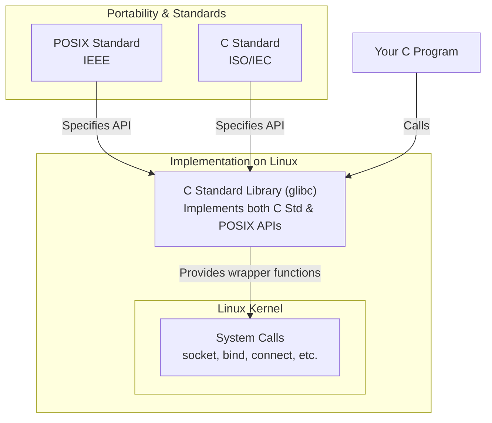

# Standard Library

## C Standard Library Headers vs POSIX Headers

The C standard library (the *language* spec) is the baseline specification governing what must be included natively with any conforming C compiler. It includes headers like `<stdio.h>` (`printf`, `open`), `<stdlib.h>` (`malloc`, `exit`), `<string.h>` (`strlen`) and `<math.h>`. C standard libraries are guaranteed on any conforming C implementation (Windows, Linux, macOS, embedded systems) and are standardized by ISO/IEC (e.g. C99/11/17/23)

POSIX (the *operating system* spec) is a family of standards defined by the IEEE to ensure software compatibility across Unix-like operating systems. It acts as a massive **superset** of the C Standard Library. Because standard C lacks APIs for complex operating system tasks (like process management, multi-threading, or networking), POSIX steps in to define them, e.g. `<unistd.h>` (`fork`, `pipe`), `<pthread.h>`, `<sys/socket.h>`, lower-level I/O (`open`, `read`, `write`). POSIX headers are guaranteed on POSIX-compliant systems (Linux, macOS, BSD, Solaris, AIX), standardized by IEEE (e.g. POSIX.1-2008). They are not guaranteed on Windows (though MSYS2/Cygwin/WSL can provide them).

Functions like `socket()`, `bind()`, `connect()` etc. are not part of the C standard library. They are part of the POSIX standard for network programming on Unix-like systems.

`libc` is the **concrete compiled library file** that provides the tangible binaries for your code to link against. It packages the **implementation** of both the C Standard Library and POSIX APIs into a single binary file (such as `libc.so` or `libc.a`). It handles the low-level, platform-specific conversion of abstract functions into actual system calls targeted to your specific OS kernel. Examples: GNU C Library (glibc).

`libc` is **automatically linked** in every C program. You don't have to specify `-lc` (though it's what happens behind the scenes). You can **explicitly avoid** `libc` for special cases like kernels, bootloaders, embedded systems with `-nostdlib -ffreestanding`, but then you can't rely on standard functions like `printf` or `malloc`.

## `<cstdlib>`
### `void exit(int)`
- Terminates program **immediately** without cleaning up **local stack** objects
- Destroys 
    - all objects with **static storage duration** (global variables)
    - objects with **thread-local storage duration** 
- Also flushes and closes all open **C input/output streams**
- `0` or `EXIT_SUCCESS` indicates program completed successfully
- Any non-zero value or `EXIT_FAILURE` indicates abnormal termination
:::warning
It does **not** call destructors for automatic local stack variables. Because it skips stack unwinding, it can leak resources managed by local RAII objects (like `std::unique_ptr` or `std::ofstream`)
:::
:::tip 
`return 0` from `main` is the standard clean way to exit which performs stack unwinding and calls local destructors
:::

## `<iostream>`
### `void perror(const char *s)`
- Prints a textual description of the error code currently stored in the system variable `errno` to `stderr`, followed by a newline.
- Useful when working with functions that set `errno` on failing 

