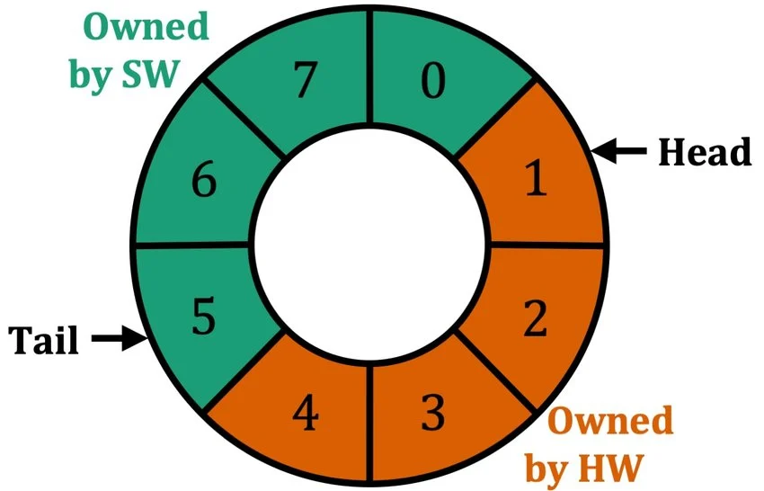

# Userspace Networking

Disclaimer: This is just my own understanding of how kernel bypass / userspace networking works. It may contain inaccuracies.

## Traditional Network Flow

The **Network Interface Card** (NIC) is the hardware component that directly receives data packets over (typically) wired connections (it's possible to receive data wirelessly through Wifi though it's probably not what you want for low-latency networking).

When a packet arrives, the NIC reads an entry from the head of a RX (receive) **descriptor ring** (a circular ring buffer in RAM). An entry contains the address of a buffer in RAM that the packet can be written to, the size of the buffer, as well as status bits (owned by hardware (HW) / software (SW) / done). 

Using **Direct Memory Access** (DMA), the NIC can write the data packet directly to this buffer without the help of the CPU by taking over the system bus. When it is done writing to the buffer, it raises an interrupt request (**IRQ**) (or the more modern, high-performance version MSI (Message Signaled Interrupts)).

The CPU saves its current state, halts its execution, searches the Interrupt Descriptor Table (**IDT**) / Interrupt Vector Table (**IVT**) for the NIC's  interrupt service routine (**ISR**), acknowledges the interrupt, disables further interrupts, and schedules **NAPI** (New API, a Linux mechanism to handle network device events). This places the NIC driver's `poll` function onto a high-priority `softirq` queue (specifically `NET_RX_SOFTIRQ` for receive). The ISR then returns, handing control back to the kernel's scheduler. When the scheduler decides it's time (usually immediately after the ISR returns, but sometimes delayed depending on system load), it executes the scheduled `softirq` on a CPU core (this is where the actual NIC driver logic runs). 

The driver's `poll` function is then executed, which looks at the descriptor rings in RAM, processes all the received packets, hands them up the IP stack as an `sk_buff`, and recycles the descriptors back to the NIC (unmaps the descriptor ring entries). The network stack involves processing protocols (Ethernet -> IP -> TCP/UDP), queueing the packet in the socket `recv()` receive queue, waking up the process and copying the packet into user buffer.

To prevent the CPU from being overwhelmed by millions of interrupts per second (interrupt storm), almost all modern high-performance NICs use **Interrupt Moderation** and NAPI. Instead of interrupting the CPU on every packet, it only fires an interrupt when a certain number of packets have arrived, or a timer has expired. The ISR also disables NIC interrupts while the bottom half is running. The bottom half (driver) uses a polling loop to drain *all* pending packets from the descriptor rings . Only when the driver is finished processing every packet does it re-enable the NIC's interrupts. 

### Direct Memory Access

Direct Memory Access (DMA) is a computer architecture feature that allows hardware peripherals (like network cards, graphics processors, and disk drives) to transfer data to and from RAM independently of the CPU. 

Without DMA, the CPU must manually read and write every single piece of data, locking up processing power. With DMA, the CPU initiates the transfer by sending memory addresses and byte counts to a dedicated DMA Controller (DMAC).

The DMAC takes control of the system bus and handles the data movement itself. The CPU is freed up to execute other computational tasks while the transfer occurs. Once the transfer is complete, the DMAC sends an interrupt to notify the CPU. This process drastically reduces latency, prevents system bottlenecks, and maximizes overall processing efficiency. 

### Descriptor Ring

The role of the Ring Descriptor is to tell the NIC where in some pre-allocated memory pool are there free objects for the NIC to DMA it's receiving packets.

Each entry (descriptor) in the ring holds metadata (like a physical memory address and size) pointing to a buffer in the main system memory.

There are both Receive (RX) Ring Descriptors and Transmit (TX) Ring Descriptors. An NIC may have multiple RX and TX queues. 

### NAPI

NAPI (New API) in the Linux kernel is a mechanism for handling network device events. Instead of the network card triggering a CPU interrupt for every single packet which can overwhelm the system under heavy traffic, NAPI temporarily disables hardware interrupts and uses a poll function to process packets in batches.

The NAPI process functions through this sequence: 
- Initial Interrupt: Packets arrive and are DMA'd to memory; the Network Interface Card (NIC) generates an IRQ.
- Interrupt Handling: The driver's IRQ handler disables further hardware interrupts to prevent storms and schedules the NAPI poll.
- Polling & Budget: The kernel's SoftIRQ mechanism (or a dedicated NAPI thread in Threaded NAPI) processes packets up to a designated budget limit.
- Completion: If the budget is exhausted before all packets are cleared, polling continues. Once the work completes, NAPI is disabled and hardware interrupts are re-enabled.

### `sk_buff`

`sk_buff` is the main networking structure representing a packet in Linux. When a packet is being processed, the driver allocates an `sk_buff`. 

### IOMMU

Input-Output Memory Management Unit (**IOMMU**) translates device addresses (GPUs, NICs, storage drives) to RAM addresses for DMA. It validates memory access forsecurity and prevent accidental or malicious writes to system memory. It is like a memory firewall and translater. Drivers use the DMI API (`dma_alloc_coherent()`, `dma_map_single`, `dma_unmap_single()`) without interacting directly with the IOMMU. 

### Memory Mapped IO (MMIO)

Memory-Mapped I/O (**MMIO**) assigns hardware device registers to specific physical memory addresses. This allows the CPU to control peripherals (like graphics cards, network interfaces, or sensors) using standard load and store instructions rather than dedicated I/O commands.

Instead of routing to system RAM, the memory controller identifies transactions directed to predefined MMIO address ranges and routes them to the physical device. Because these addresses map directly to hardware registers, read and write operations must be designated as *uncacheable* to prevent the CPU from pulling stale data from local cache.

Use cases include device control e.g. toggling GPIO pin by writing values to mapped control and status registers, and high-speed data transfer by streaming packets into mapped memory windows.

### Network Stack

## Kernel Bypass

There are a lot of inefficiencies and overhead in processing packets in the traditional network flow. Some principles of improving the effiency include: using shared memory to reduce data copies, batch packet processing to amortize per-packet cost of system calls, NIC ring management, improving cache locality, and simplifying data structures by removing unnecessary complex metadata, and using fixed sized buffers.

### Netmap

### DPDK

## Relevant Articles

- [Userspace networking - Rutgers University Lecture](https://people.cs.rutgers.edu/~sn624/552-F19/lectures/14-userspace-networking.pdf)
- [Understanding DMA - Sachin Sharma](https://sachinsharma111.substack.com/p/understanding-dma-how-the-dma-controller?r=65cgx3&utm_campaign=post&utm_medium=web&triedRedirect=true)
- [NAPI - Linux Kernel Docs](https://docs.kernel.org/networking/napi.html)
- [Ring Descriptor - Research Gate](https://www.researchgate.net/figure/A-descriptor-ring-containing-8-elements-Descriptors-1-to-4-belong-to-the-NIC-while-ones_fig1_353510404)
- [skbuff - Linux Kernel Docs](https://docs.kernel.org/networking/skbuff.html)
- [Building a Network Stack](https://www.linkedin.com/pulse/user-space-kernel-build-your-own-linux-network-stack-mohit-mishra-rs5ec/)
